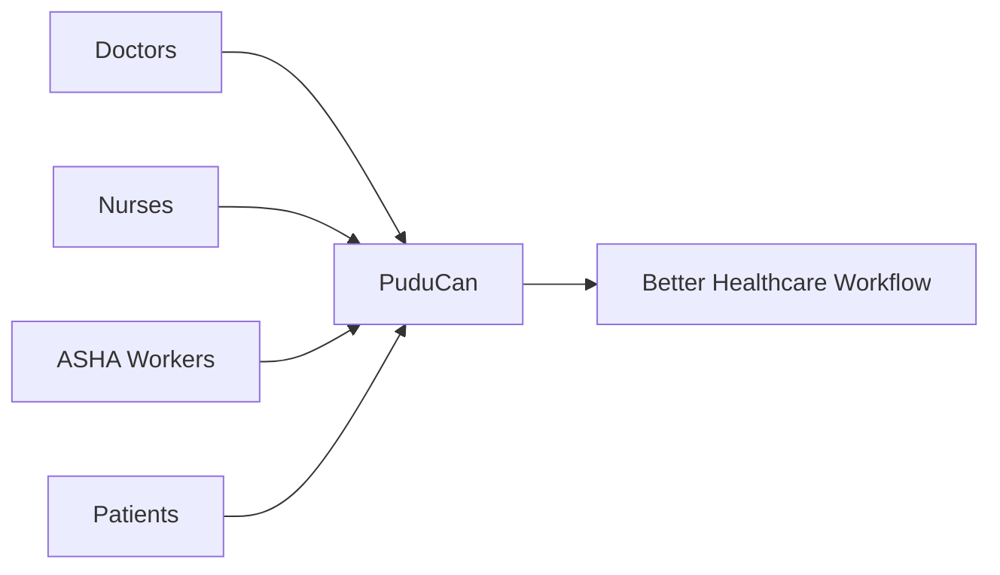
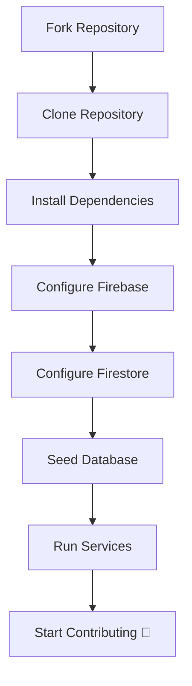
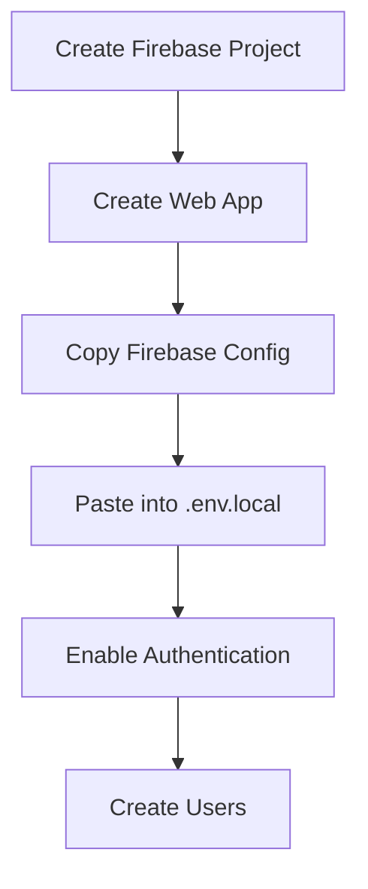
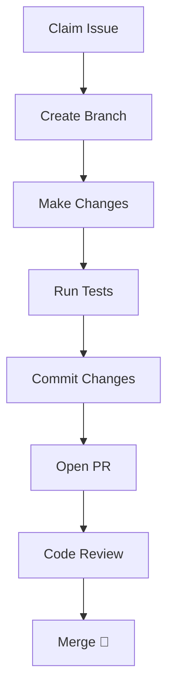

# <div align="center">🌟 CONTRIBUTING TO PUDUCAN 🌟</div>

<div align="center">

### *Cancer Tracker — JIPMER*


</div>

---

<div align="center">

# ❤️ Welcome, Contributor

</div>

PuduCan is not just another software project.

It is a healthcare initiative built to support **real patients, doctors, nurses, ASHA workers, and hospitals across India**.

Every contribution — whether it's:

- fixing a typo,
- improving UI,
- writing tests,
- improving accessibility,
- refactoring code,
- or building features,

helps improve a real healthcare workflow.

And that makes your contribution meaningful.

We genuinely appreciate your time and effort.

---

<div align="center">

## 🌱 New to Open Source?

</div>

You are absolutely welcome here.

You do **not** need to be an expert developer to contribute.

Small contributions matter.

Asking questions is encouraged.

Learning publicly is encouraged.

Everyone starts somewhere ❤️

---

# 📚 Table of Contents

- [🌍 Project Philosophy](#-project-philosophy)
- [🚀 Local Development Setup](#-local-development-setup)
  - [1️⃣ Fork & Clone](#1️⃣-fork--clone)
  - [2️⃣ Install Dependencies](#2️⃣-install-dependencies)
  - [3️⃣ Configure Firebase](#3️⃣-configure-firebase)
  - [4️⃣ Configure Firestore](#4️⃣-configure-firestore)
  - [5️⃣ Seed Database](#5️⃣-seed-database)
  - [6️⃣ Run Individual Services](#6️⃣-run-individual-services)
  - [7️⃣ Run the Full Application](#7️⃣-run-the-full-application)
- [🧠 Using `.claude/agents/`](#-using-claudeagents)
- [🌿 Branching Strategy](#-branching-strategy)
- [📝 Commit Convention](#-commit-convention)
- [🧪 Testing Workflow](#-testing-workflow)
- [🔀 Pull Request Process](#-pull-request-process)
- [📌 Issue Claiming Workflow](#-issue-claiming-workflow)
- [🧹 Contributor Expectations](#-contributor-expectations)
- [🟢 Beginner-Safe Contribution Areas](#-beginner-safe-contribution-areas)
- [🚫 Restricted Architectural Areas](#-restricted-architectural-areas)
- [🐛 Reporting Bugs](#-reporting-bugs)
- [🛡️ Code of Conduct](#️-code-of-conduct)
- [📬 Need Help?](#-need-help)

---

# 🌍 Project Philosophy

<div align="center">



</div>

PuduCan exists to simplify healthcare workflows and improve accessibility in medical systems.

This means:

- Reliability matters
- Accessibility matters
- Simplicity matters
- Performance matters
- Empathy matters

When contributing, try to think not only like a developer — but also like a healthcare worker using the product during a busy shift.

---

# 🚀 Local Development Setup

<div align="center">



</div>

---

# 1️⃣ Fork & Clone

Fork the repository to your GitHub account.

If you like the project, consider giving it a ⭐

It helps the project grow and motivates contributors.

Clone your fork locally:

```bash
git clone https://github.com/<your-username>/puducan-jipmer.git
cd puducan-jipmer
```

---

# 2️⃣ Install Dependencies

We use **pnpm** as the package manager.

Install dependencies:

```bash
pnpm install
```

Create environment file:

```bash
cp .env.example .env.local
```

---

# 3️⃣ Configure Firebase

<div align="center">



</div>

PuduCan uses Firebase for:

- Authentication
- Firestore Database
- User Management

Use the free Spark Plan for development.

---

## Create Firebase Project

Visit:

```text
https://firebase.google.com
```

Then:

1. Create project
2. Create web app
3. Copy Firebase credentials
4. Paste credentials into `.env.local`

---

## Enable Authentication

Enable:

```text
Email/Password Authentication
```

Create the following development users:

| Role | Email | Password |
|---|---|---|
| Admin | admin@gmail.com | jipmer |
| Doctor | doctor@gmail.com | jipmer |
| Nurse | nurse@gmail.com | jipmer |
| ASHA | asha@gmail.com | jipmer |

---

# 4️⃣ Configure Firestore

Go to:

```text
Build → Firestore Database
```

Create database and replace rules with:

```js
service cloud.firestore {
  match /databases/{database}/documents {
    match /{document=**} {
      allow read, write: if request.auth != null;
    }
  }
}
```

> ⚠️ Development-only rules.
>
> Production security rules are intentionally stricter and still evolving.

---

# 5️⃣ Seed Database

Run:

```bash
pnpm run seed:users
pnpm run seed:patients
pnpm run seed:hospitals
```

---

# 6️⃣ Run Individual Services

You do **not** need Docker for local development.

Individual services can be run independently.

Example:

```bash
pnpm dev
```

Or run specific apps/services:

```bash
pnpm --filter web dev
pnpm --filter api dev
```

This makes debugging and development faster for contributors.

---

# 7️⃣ Run the Full Application

Start the application:

```bash
pnpm dev
```

Open:

```text
http://localhost:3000
```

---

# 🧠 Using `.claude/agents/`

This repository may contain reusable AI workflow agents inside:

```text
.claude/agents/
```

These agents are used to:

- standardize development workflows,
- assist with repetitive tasks,
- improve contributor productivity,
- maintain consistency across changes.

If contributing to workflows or automation:

- review existing agents first,
- avoid duplicating behavior,
- follow the established structure and naming patterns.

---

# 🌿 Branching Strategy

Always branch from:

```text
main
```

Use the following naming conventions:

| Prefix | Purpose | Example |
|---|---|---|
| `feat/` | New features | `feat/patient-export` |
| `fix/` | Bug fixes | `fix/login-redirect` |
| `docs/` | Documentation | `docs/update-contributing` |
| `refactor/` | Refactors | `refactor/firebase-hooks` |
| `test/` | Tests | `test/patient-service` |
| `chore/` | Maintenance | `chore/update-eslint` |

---

# 📝 Commit Convention

We follow **Conventional Commits**.

Format:

```text
type(scope): short description
```

Examples:

```text
feat(auth): add role redirects
fix(table): resolve sorting issue
docs(contributing): improve setup guide
refactor(api): simplify patient queries
```

Valid types:

- feat
- fix
- docs
- style
- refactor
- test
- chore

---

# 🧪 Testing Workflow

Before opening a PR, run:

```bash
pnpm lint
pnpm format
pnpm test
```

Run individual test suites when needed:

```bash
pnpm test --filter api
pnpm test --filter web
```

Please ensure:

- new logic includes tests,
- existing tests continue passing,
- changes do not introduce regressions.

> ✅ Husky hooks may automatically run checks before commits.

---

# 🔀 Pull Request Process

<div align="center">



</div>

## 📌 Keep PRs Focused

One PR should ideally solve one issue or add one feature.

Smaller PRs are easier to review and merge.

---

## 📌 Explain Changes Clearly

In your PR description:

- explain what changed,
- explain why it changed,
- mention anything reviewers should pay attention to.

Perfect grammar is NOT required.

Clarity matters more.

---

## 📌 Add Tests Where Necessary

Changes affecting logic or behavior should include tests.

---

## 📌 Never Commit Sensitive Files

Never commit:

- `.env`
- API keys
- Firebase credentials
- secrets

---

# 📌 Issue Claiming Workflow

Before starting work:

1. Check if the issue is already assigned
2. Comment on the issue expressing interest
3. Wait for maintainers to assign/approve if required

Example:

```text
I'd like to work on this issue.
```

This helps prevent duplicate work and keeps contribution flow organized.

If you become inactive for extended periods without updates, maintainers may reassign the issue.

---

# 🧹 Contributor Expectations

We value:

- kindness,
- collaboration,
- consistency,
- maintainability,
- respectful communication.

Please:

- communicate clearly,
- ask questions when unsure,
- avoid unnecessary complexity,
- follow existing architecture patterns,
- be respectful during reviews.

We care more about thoughtful contributions than perfect code.

---

# 🟢 Beginner-Safe Contribution Areas

These areas are generally safe for new contributors:

- documentation improvements,
- UI polishing,
- accessibility improvements,
- adding tests,
- fixing small bugs,
- improving error states,
- improving loading states,
- refactoring isolated components,
- improving developer experience.

Look for labels like:

```text
good first issue
beginner friendly
documentation
```

---

# 🚫 Restricted Architectural Areas

The following areas are considered advanced/core infrastructure:

- Redis Streams
- orchestration systems
- async workflow internals
- distributed event processing
- background job pipelines
- low-level infrastructure abstractions

Please avoid modifying these areas unless:

- specifically assigned,
- discussed with maintainers,
- or you fully understand the architecture implications.

These systems are critical to application stability.

---

# 🐛 Reporting Bugs

Please include:

- clear title,
- expected behavior,
- actual behavior,
- reproduction steps,
- screenshots if applicable,
- environment details.

Good bug reports save maintainers significant debugging time ❤️

---

# 🛡️ Code of Conduct

Please be:

- respectful,
- constructive,
- patient,
- collaborative,
- kind.

This is a healthcare-focused project.

Empathy matters both in the product and the community.

---

# 📬 Need Help?

If you're stuck:

- open a GitHub Issue,
- start a GitHub Discussion,
- ask questions in PR threads.

Nobody is expected to know everything.

Asking questions is part of contributing ❤️

---

<div align="center">

# ❤️ Final Note

Thank you for contributing to PuduCan.

Every contribution — no matter how small — helps improve healthcare technology for real people.

We appreciate you.

### Happy Building 🚀

</div>
