

# 🩺 PuduCan
**PUDUcherry Cancer Patient Management Dashboard**

A modern healthcare platform built for ASHA workers, nurses, and doctors to manage cancer patient data efficiently — part of a national study led by JIPMER and sponsored by ICMR.

🔗 **[View Live Demo →](https://cancer-tracker-jipmer.vercel.app)**

### Focus Area
We are eagerly looking to launch the version v1.1 so kindly focus on the v1.1 related issues [LINK](https://github.com/lourduradjou/puducan-jipmer/issues?q=is%3Aissue%20state%3Aopen%20milestone%3Av1.1.1)

## Screenshots of the Project
 
#### 🏠 Home Page
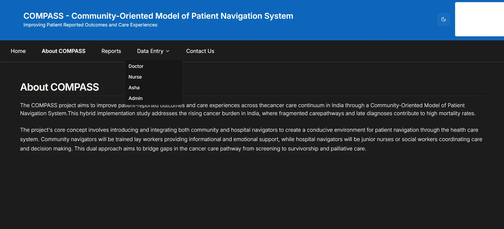
 
#### 🧑‍💼 Admin — Patients View (Dark theme)
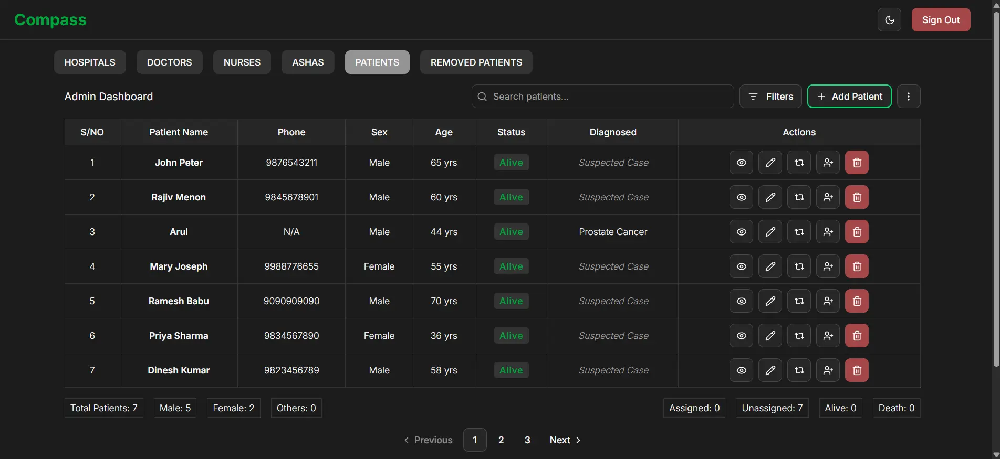
 
#### 🧑‍💼 Admin — Patients View (Light theme)
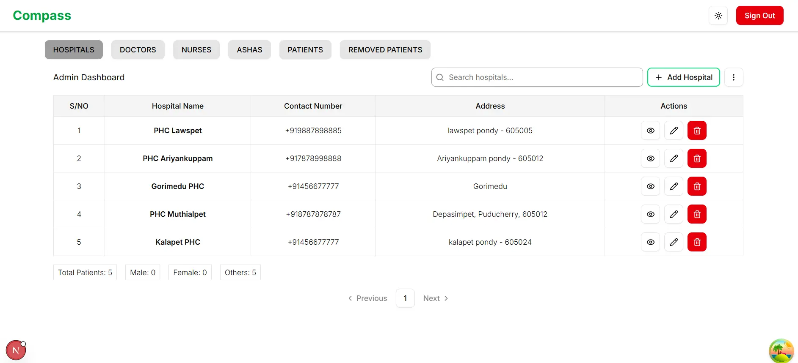
 
#### 📊 Patient Disease Report
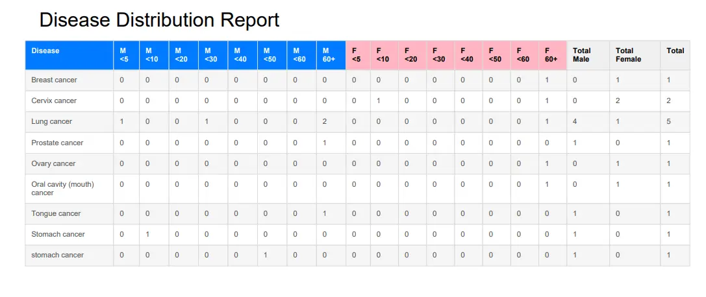
 
#### ➕ Add Doctor / Nurse / ASHA
> The same form is used for all staff types — field labels change based on role.
 
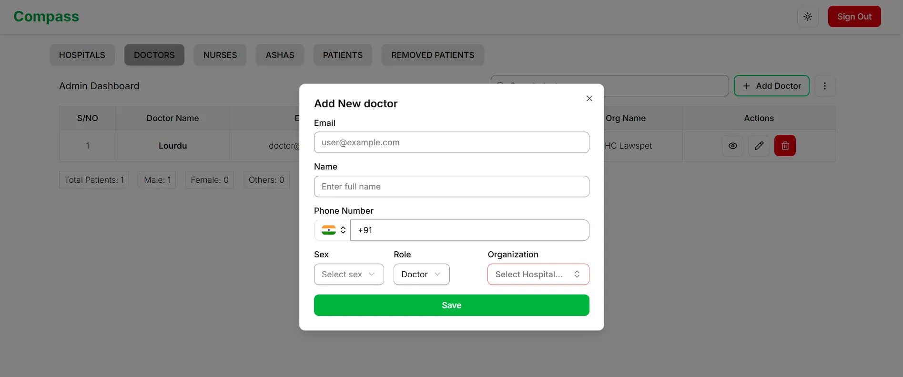
 
#### 🏥 Add Hospital
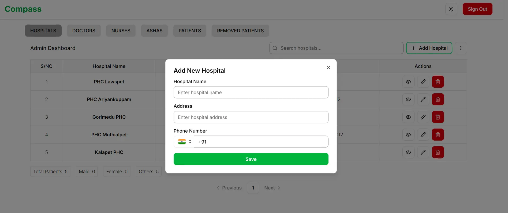
 
#### ♻️ Admin — Recover Deleted Patient
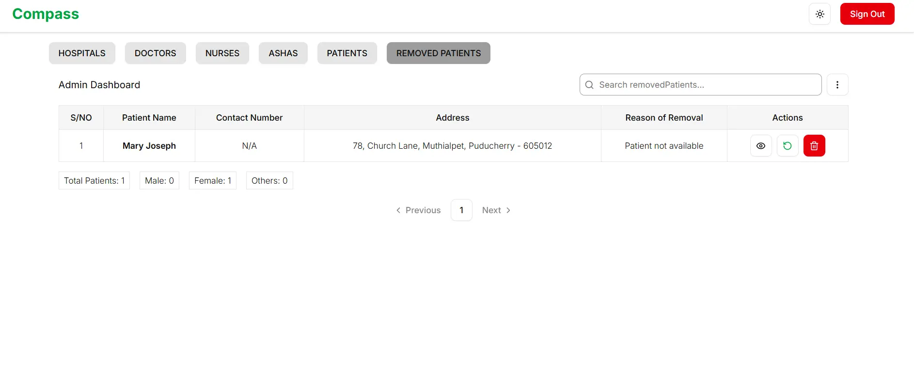
 
#### 👨‍⚕️ Doctor — Patients View
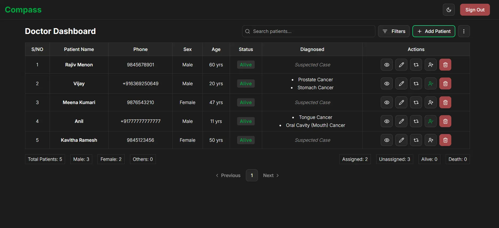
 
#### 👩‍⚕️ Nurse — Patients View
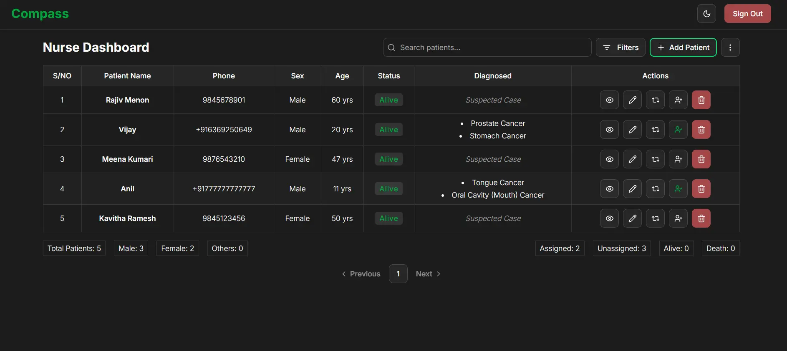
 
#### 📋 Add Patient Form
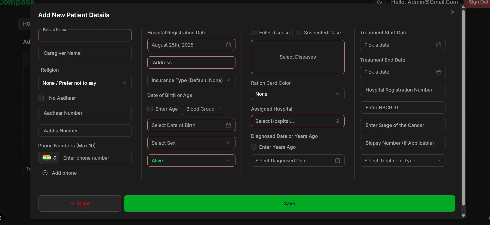
 
#### 📱 ASHA Worker — Patients View (Mobile)
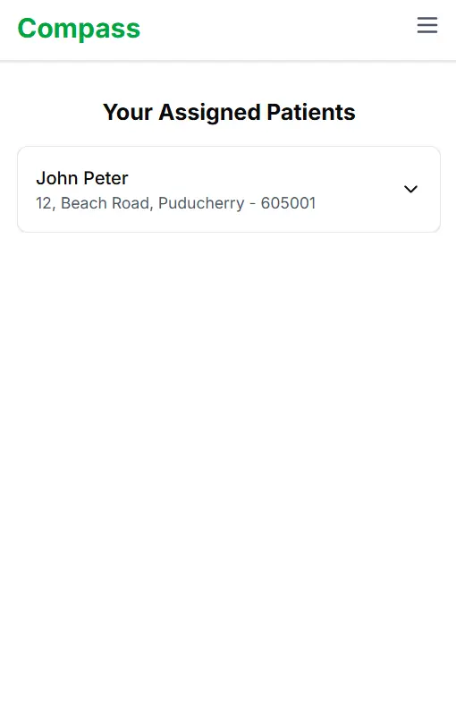
 
#### 🗑️ Delete Patient View
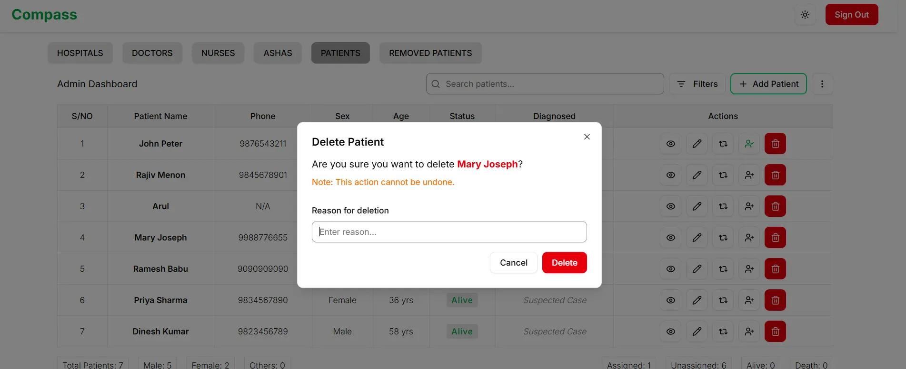
 
---
## ✨ Core Features

* **Role-Based Access Control (RBAC):** Dedicated dashboards and permissions for different user roles (Admin, Doctor, Nurse, ASHA Worker) to ensure data security and a tailored user experience.
* **Comprehensive Patient Management:** A centralized system for adding, viewing, updating, and deleting patient records with detailed forms and data validation.
* **Advanced Data Table:** A responsive and feature-rich table for displaying patient data, including:
    * **Search and Filtering:** Dynamic search functionality and advanced filtering options to quickly find specific patient records.
    * **Pagination:** Efficiently navigate through large datasets with client-side pagination.
    * **Data Export:** Export patient data to CSV or Excel formats for reporting and analysis.
* **Data Import:** Seamlessly import patient data from CSV or Excel files, with data validation and error reporting.
* **Real-time Updates:** Leverages Firebase's real-time capabilities to ensure that data is always up-to-date across all users.
* **User and Hospital Management (Admin):** Admins have the ability to manage users and hospital information through dedicated interfaces.

## 🚀 Performance Optimizations and Caching

The application is built with performance as a top priority, utilizing a combination of modern web technologies and best practices to ensure a fast and responsive user experience.

### Next.js Optimizations

* **Automatic Code Splitting:** Next.js automatically splits the JavaScript bundle into smaller chunks, so users only download the code necessary for the page they are viewing. This significantly reduces the initial load time.
* **Image Optimization:** The `next/image` component is used to automatically optimize images, serving them in modern formats like WebP and resizing them for different devices.
* **Static Site Generation (SSG):** Pages that don't require real-time data, such as the "About" and "Contact" pages, are pre-rendered at build time for instant loading.

### Data Fetching and Caching with TanStack Query

* **Server-Side State Management:** We use **TanStack Query (React Query)** to manage asynchronous data from Firestore. This provides a robust caching mechanism that reduces redundant API calls and improves the user experience.
* **`staleTime` and `cacheTime`:** Queries are configured with `staleTime` to serve cached data while re-fetching in the background, ensuring that the UI is always responsive. `cacheTime` is used to keep data in the cache for a specified period, even when it's not being used.
* **Query Invalidation:** When data is updated (e.g., a patient record is edited), the relevant queries are invalidated to trigger a re-fetch and ensure that the UI is updated with the latest information.

### Client-Side Caching and State Management

* **Zustand for Global State:** We use **Zustand** for lightweight global state management. This allows us to share state across components without the complexity of larger state management libraries.
* **`localStorage` for Form Data:** To prevent data loss during form entry, we use `localStorage` to cache the form state. If the user accidentally reloads the page, their progress is saved and can be restored.

## 🏗️ Code Quality and Refactoring

The codebase is designed to be modular, maintainable, and scalable, following modern software engineering principles.

### Component-Based Architecture

* **Reusable Components:** The UI is broken down into small, reusable components, each with a single responsibility. This makes the code easier to understand, test, and maintain.
* **Generic Components:** We've created generic components, such as the `GenericTable` and `GenericDialog`, which can be reused across different parts of the application, reducing code duplication.

### Custom Hooks

* **Encapsulated Logic:** We've created custom hooks to encapsulate and reuse logic for tasks such as:
    * `useAuth`:  Manages user authentication state and provides user information to components.
    * `useTableData`:  Fetches and manages data for the data table, including pagination, searching, and filtering.

### Code Style and Linting

* **ESLint and Prettier:** We use **ESLint** and **Prettier** to enforce a consistent code style and catch potential errors early. This ensures that the codebase is clean, readable, and easy to work with.
* **Husky Pre-commit Hooks:** We use **Husky** to run linting and tests before each commit, preventing errors from being introduced into the codebase.

### Testing

* **Unit and Integration Tests:** We use **Vitest** and **React Testing Library** to write both unit and integration tests for our components and business logic. This ensures that the application is reliable and that new features don't break existing functionality.

## 🛠️ Tech Stack

* **Framework:** [Next.js](https://nextjs.org/)
* **Database:** [Firebase Firestore](https://firebase.google.com/docs/firestore)
* **Authentication:** [Firebase Authentication](https://firebase.google.com/docs/auth)
* **Styling:** [Tailwind CSS](https://tailwindcss.com/)
* **UI Components:** Custom components built with [shadcn/ui](https://ui.shadcn.com/) and [Radix UI](https://www.radix-ui.com/).
* **State Management:** [Zustand](https://github.com/pmndrs/zustand)
* **Data Fetching and Caching:** [TanStack Query (React Query)](https://tanstack.com/query/latest)
* **Form Management:** [React Hook Form](https://react-hook-form.com/)
* **Schema Validation:** [Zod](https://zod.dev/)
* **Testing:** [Vitest](https://vitest.dev/) and [React Testing Library](https://testing-library.com/docs/react-testing-library/intro/)

## Assets Folder
It contains a sample excel file that showcase how the importing data should look like.

## 🤝 Contributing
 
We welcome contributors of all experience levels! PuduCan is a real-world healthcare tool — your contribution will matter to actual patients and doctors across India.
 
**New to open source?** Start here →  

 
These are hand-picked issues that are well-scoped, clearly explained, and don't require deep knowledge of the codebase. A great place to make your first PR.
 
Read the full [Contributing Guide →](CONTRIBUTING.md) | View [Architecture →](ARCHITECTURE.md)

Thanks goes to these wonderful people:

<!-- ALL-CONTRIBUTORS-LIST:START -->
<!-- prettier-ignore-start -->
<!-- markdownlint-disable -->
<table>
  <tbody>
    <tr>
      <td align="center" valign="top" width="14.28%"><a href="http://www.lourduradjou.xyz"> <b>Lourdu Radjou🎶</b></a> <a href="#code-lourduradjou" title="Code">💻</a> <a href="#doc-lourduradjou" title="Documentation">📖</a> <a href="#maintenance-lourduradjou" title="Maintenance">🚧</a></td>
      <td align="center" valign="top" width="14.28%"><a href="https://github.com/MozamilS"> <b>Sayed Subhan Shah Sadat</b></a> <a href="#code-MozamilS" title="Code">💻</a></td>
    </tr>
  </tbody>
</table>

<!-- markdownlint-restore -->
<!-- prettier-ignore-end -->

<!-- ALL-CONTRIBUTORS-LIST:END -->

